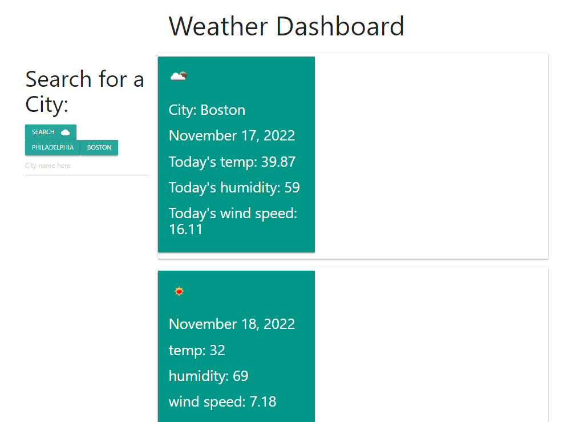

# Weather-Dashboard

## About the Project 
This weather dashboard was created to allow you to find the weather in any given city. Use the search bar to type in a city name, hit the search button, and the site will provide the temperature, humidity, and wind speed for the current day, as well as a five day forecast. Once you've searched for a city, the weather dashboard will save your searches in local storage, and will allow you to easily click on past searches to view that cities weather again.

## Project Preview 

## Project Link
[Weather-Dashboard-Link](https://estilbee.github.io/Weather-Dashboard/)

## Technologies Used
- Html
- JavaScript
- JQuery
- Materialize 